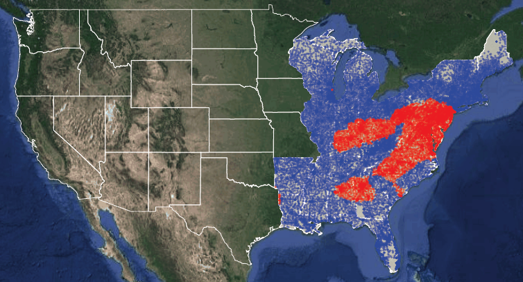
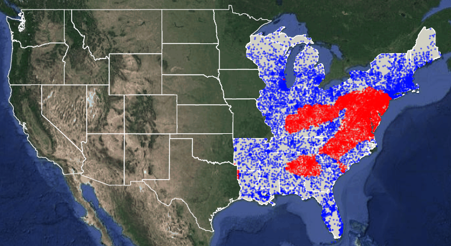
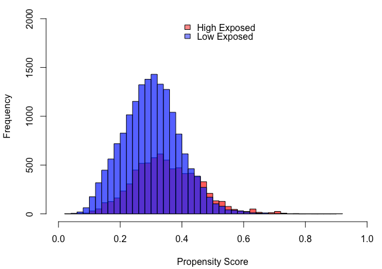
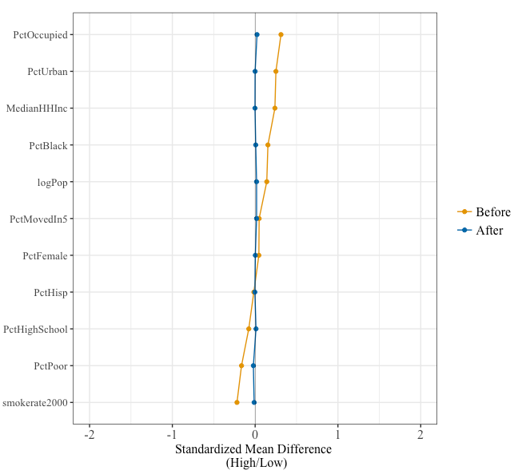

# sourceOrientedApproach
R package for the analysis performed in A Source-Oriented Approach to Coal Combustion Emissions (need to add more info here)

# Installing sourceOrientedApproach
In RStudio, install the sourceOrientedApproach R package from github.  
### Install and load devtools
```
install.packages(c('devtools','data.table'))
library(devtools)
library(data.table)
```
### Install and load sourceOrientedApproach
```
devtools::install_github("kfcaby/sourceOrientedApproach")
library(sourceOrientedApproach)
```
# sourceOrientedApproach example

Estimate the effect of high coal emissions exposure on ischemic heart disease (IHD) hospitalizations in the MEDICARE population.

## Create a data set for analysis

### ihd2005 
Outcome: ihd2005 contains a data table of simulated MEDICARE health outcomes in 2005.  The IHD column contains the simulated number of ischemic heart disease hospitalizations in the MEDICARE population in 2005 at each U.S. ZIP code.  The person_years column is the number of observed person years contributing to the hospitalizations.  You can load the data set using ```data('ihd2005')```. (need to get these from Cory)

### inmap2005
Exposure: inmap2005 contains a data table of the estimated PM2.5 at each ZIP code attributible to the emissions from 783 coal-fired power generating units operating in the U.S. in 2005.  We obtained these estimates using the Intervention Model for Air Pollution (add citation - also a reference to rinmap). You can load the data set using ```data('inmap2005')```.

### covariates
Covariates: covariates contains a data table of potential confounders of the IHD/exposure relationship. They include various demographic and socioeconomic characteristics of each ZIP code from census data, smoking rates, and climitalogical variables. You can load the data set using ```data('covariates')```.

NOTE: NEED TO ADD WEATHER TO THESE

## Analyzing a data set

### Perform propensity score matching to adjust for potential confounders
```
# Include these regions
regions <- c("IndustrialMidwest", "Northeast", "Southeast")

# Covariates to adjust for using propensity score matching
covariate.vars <- c("logPop","PctUrban","PctBlack","PctHisp","PctHighSchool", 
"MedianHHInc", "PctPoor","PctFemale","PctOccupied","PctMovedIn5", "smokerate2000")

dataset <- getMatchedDataset(exposure = inmap2005, covariates, covariate.vars, regions)
```
### Plot U.S. maps of the exposure
```
# Continuous Exposure
plotExposureUSmap(dataset$raw, exposure.binary = FALSE)
```

```
# Binary Exposure
plotExposureUSmap(dataset$raw, exposure.binary = TRUE)
```

```
# Matched data
plotExposureUSmap(dataset$matched, exposure.binary = TRUE)
```
UPDATE THIS ONCE I HAVE WEATHER DATA

### Other useful information
```
# Histogram of the propensity scores by high exposed and controls
plotPropensityScoreHistogram(dataset$raw)

# Standardized mean difference plot (before and after matching)
createSMDplot(dataset$matched.model)

# Summary of matching results
dataset$match.model$nn
```


### Estimate incidence rate ratio (IRR) for IHD comparing high exposed locations to the controls
```
outcome.model <- fitOutcomeModel(dataset$matched, ihd2005, covariate.vars)
summary(outcome.model)

# Coefficients and confidence intervals on natural scale
cbind(exp(coef(outcome.model)), exp(confint(outcome.model)))
```
